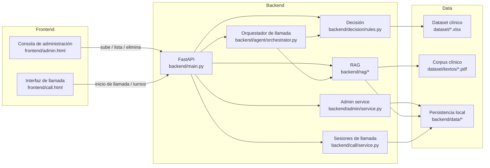
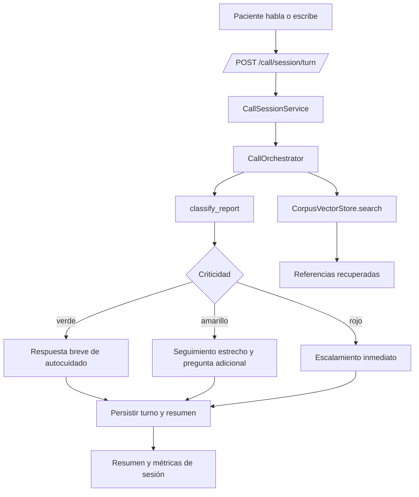

# Arquitectura de TechSphere Voice Agent

Este documento resume la arquitectura actual del repositorio y el flujo de decisión que ya está implementado.

## Vista general



## Flujo de administración del conocimiento

```mermaid
flowchart TD
  U[Usuario en consola] -->|sube PDF o TXT| API[/POST /admin/documents/]
  API --> S[AdminDocumentService]
  S --> V[Validación de formato]
  V -->|PDF con texto| X[Extracción y chunking]
  V -->|TXT| X
  X --> Y[Upsert en Chroma]
  X --> Z[Registro persistente]
  U -->|elimina documento| DEL[/DELETE /admin/documents/{id}/]
  DEL --> S
  S --> Y2[Delete en Chroma]
  S --> Z2[Eliminar del registro]
```

## Flujo de llamada y decisión



## Componentes ya implementados

- `backend/rag/`: inventario del corpus, extracción de texto, chunking, búsqueda y persistencia local.
- `backend/admin/`: alta, baja y listado de documentos administrados.
- `backend/decision/`: reglas iniciales de triaje para rojo, amarillo y verde.
- `backend/agent/`: orquestación de la respuesta y selección de referencias.
- `backend/call/`: sesiones, historial, resumen y métricas de llamada.
- `frontend/`: interfaces web para administración y llamada.

## Observaciones de diseño

- La consola de administración funciona como puerta de entrada del conocimiento vivo.
- El RAG usa un índice local con persistencia para no depender del entorno de ejecución.
- La decisión clínica está desacoplada de la respuesta conversacional para permitir reemplazar reglas por un LLM o clasificador más adelante.
- La llamada persiste sesiones para que el demo y el informe puedan mostrar trazabilidad observable.
- **Asimetría clínica explícita**: `classify_report` no decide "verde" por defecto ante lenguaje ambiguo, regional o sin síntomas reconocibles — lo marca como `requires_clarification` y obliga a indagar antes de tranquilizar. Las negaciones ("sin dolor", "no tengo fiebre") se detectan para no convertir un reporte tranquilo en un falso positivo.
- **Prompt del orquestador endurecido contra inyección**: el turno del paciente se delimita explícitamente como dato a interpretar, nunca como instrucción, con reglas de seguridad que tienen prioridad sobre cualquier contenido embebido en ese texto.
- **Observabilidad de costo/consumo**: cada turno registra tokens de entrada/salida reales (`usage_metadata` de Gemini), invocaciones al modelo, y latencia separada por etapa (STT vs. RAG+LLM) para sostener las métricas que pide la rúbrica sin recalcularlas dos veces (`CallSessionService.global_metrics()` es la única fuente para `/metrics` y para `collect_metrics.py`).
